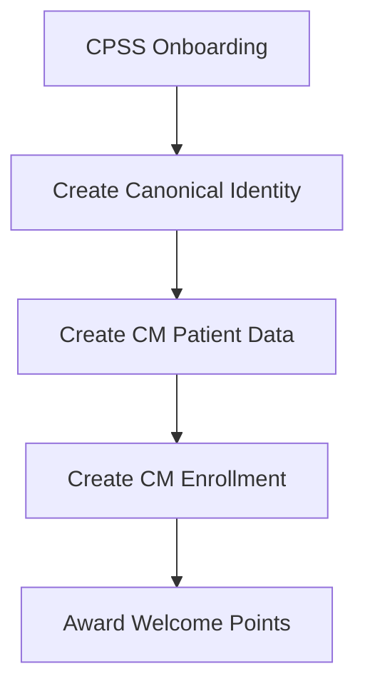
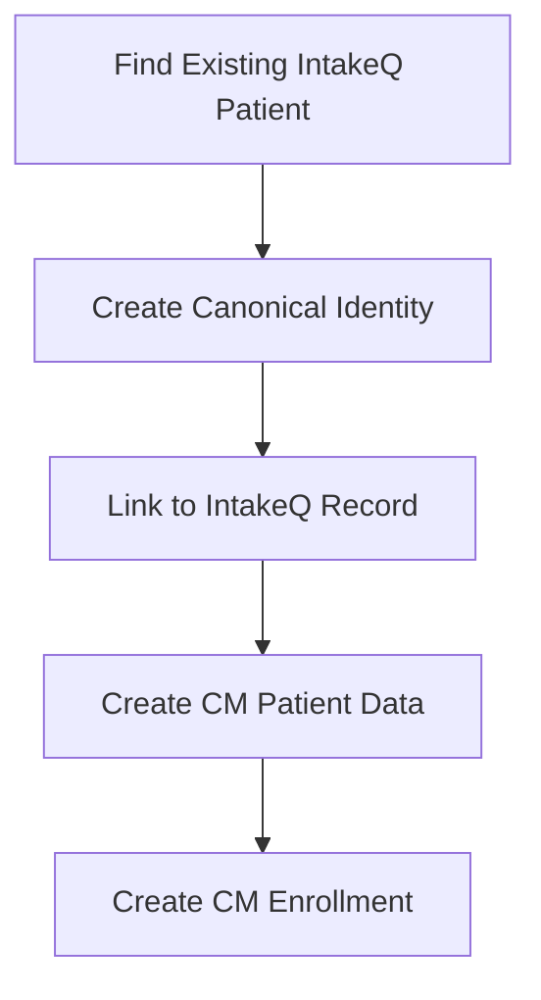

# 🏗️ Canonical Patient Identity Architecture - Implementation Guide

## Overview
This guide implements the clean separation architecture you requested, keeping CM patients completely separate from IntakeQ EMR while elegantly handling dual enrollment scenarios.

## 🎯 Implementation Steps

### Step 1: Execute Database Migration in Supabase
1. **Open Supabase Dashboard** → Your project → SQL Editor
2. **Copy and execute** the contents of `database-migration-sql.sql`
3. **Verify tables created**:
   - `patients_canonical`
   - `patients_cm` 
   - `patients_intakeq_link`
   - `providers_cm`
   - `cm_enrollments`

### Step 2: Migrate Existing Data (Optional)
If you have existing CM patients to migrate:
```bash
node migrate-to-canonical.js
```

### Step 3: Update API Server
Update your `api-server.js` to use the new canonical architecture:

```javascript
// Add to your api-server.js
const { initializeCMDatabaseCanonical } = require('./api/cm/database-canonical');
const canonicalPointsRouter = require('./api/cm/points-canonical');

// Replace existing CM routes
app.use('/api/cm', canonicalPointsRouter);

// Update initialization
async function startServer() {
  const dbReady = await initializeCMDatabaseCanonical();
  if (!dbReady) {
    console.log('⚠️ CM Database not ready - please run migration SQL');
  }
  // ... rest of server startup
}
```

## 🏆 Architecture Benefits Achieved

### ✅ Clean Separation
- **CM patients** → Stored in `patients_cm` (completely isolated)
- **IntakeQ patients** → Remain in existing `patients` table (untouched)
- **CPSS providers** → Separated in `providers_cm` table
- **No cross-contamination** between systems

### ✅ Dual Enrollment Elegantly Handled
```javascript
// Existing Moonlit patient enrolls in CM
const canonicalId = await createOrFindCanonicalPatient("John", "Smith", "1985-06-15");

// Links to existing IntakeQ record
await linkIntakeQPatient(canonicalId, existingIntakeQId);

// Creates CM-specific data without duplication
await createCMPatientData(canonicalId, contactInfo);
```

### ✅ No Duplication Issues
- **Canonical identity** prevents duplicate patient records
- **Unique constraints** enforce one record per person per system
- **Clear relationships** show dual enrollment status

## 📊 Data Flow Examples

### New CM Patient (Acute Care)


### Existing IntakeQ Patient → CM Enrollment


## 🔧 API Endpoints (Enhanced)

### Patient Enrollment
```javascript
POST /api/cm/patient/enroll
{
  "patientData": {
    "firstName": "Jessica",
    "lastName": "Martinez",
    "dateOfBirth": "1992-03-22",
    "insuranceType": "Utah Medicaid"
  },
  "contactInfo": {
    "phone": "(801) 555-0123",
    "email": "jessica@email.com",
    "hasSmartphone": "yes",
    "consent": true
  }
}
```

### Patient Lookup
```javascript
POST /api/cm/patient/lookup
{
  "firstName": "Jessica",
  "lastName": "Martinez", 
  "dateOfBirth": "1992-03-22"
}
```

### Award Points (Canonical)
```javascript
POST /api/cm/award
{
  "canonicalPatientId": "uuid-here",
  "points": 50,
  "reason": "Negative UDS result",
  "reasonCode": "negative_uds"
}
```

### Link IntakeQ Patient
```javascript
POST /api/cm/patient/link-intakeq
{
  "canonicalPatientId": "canonical-uuid",
  "intakeqPatientId": "intakeq-uuid",
  "confidenceScore": 1.00
}
```

## 🎮 Testing Your Implementation

### 1. Verify Database Setup
```bash
# Check canonical architecture
curl http://localhost:3000/api/cm/architecture/info
```

### 2. Test Patient Enrollment
```bash
# Enroll new CM patient
curl -X POST http://localhost:3000/api/cm/patient/enroll \
  -H "Content-Type: application/json" \
  -d '{
    "patientData": {
      "firstName": "Test",
      "lastName": "Patient",
      "dateOfBirth": "1990-01-01",
      "insuranceType": "Utah Medicaid"
    },
    "contactInfo": {
      "phone": "(801) 555-1234",
      "hasSmartphone": "yes",
      "consent": true
    }
  }'
```

### 3. Test Points System
```bash
# Award points to canonical patient
curl -X POST http://localhost:3000/api/cm/award \
  -H "Content-Type: application/json" \
  -d '{
    "canonicalPatientId": "your-canonical-id",
    "points": 25,
    "reason": "Group attendance", 
    "reasonCode": "group_attendance"
  }'
```

### 4. Test Dashboard
```bash
# Get dashboard stats
curl http://localhost:3000/api/cm/dashboard/stats
```

## 🔍 Query Patterns for Your Use Cases

### CPSS Dashboard - CM Patients Only
```javascript
// Get all CM patients (no IntakeQ contamination)
const cmPatients = await supabase
  .from('patients_canonical')
  .select(`
    *,
    patients_cm(*),
    cm_enrollments(*, providers_cm(*))
  `)
  .inner('patients_cm', 'id', 'canonical_patient_id')
  .eq('patients_cm.status', 'active');
```

### Admin View - Dual Enrollment Detection
```javascript
// Find patients in both systems
const dualEnrolled = await supabase
  .from('patients_canonical')
  .select(`
    *,
    patients_cm(*),
    patients_intakeq_link(*, patients(*))
  `)
  .not('patients_cm', 'is', null)
  .not('patients_intakeq_link', 'is', null);
```

### IntakeQ Integration - Check CM Status
```javascript
// When viewing IntakeQ patient, check CM enrollment
async function checkCMStatus(intakeqPatientId) {
  const link = await supabase
    .from('patients_intakeq_link')
    .select(`
      canonical_patient_id,
      patients_canonical(*),
      cm_enrollments(*)
    `)
    .eq('intakeq_patient_id', intakeqPatientId)
    .single();
    
  return link?.cm_enrollments ? 'ENROLLED_CM' : 'INTAKEQ_ONLY';
}
```

## 🎯 Migration Benefits Realized

### For CPSS Staff
- ✅ **Clean CM dashboard** showing only CM patients
- ✅ **No IntakeQ confusion** - separate patient pools
- ✅ **Dedicated provider management** for CPSS team

### For IntakeQ EMR
- ✅ **Unchanged workflow** - existing patients untouched
- ✅ **No CM data pollution** in clinical records
- ✅ **Optional CM status visibility** via linking

### For Dual-Enrolled Patients
- ✅ **Single identity** prevents duplication
- ✅ **Clear relationships** between systems
- ✅ **No data inconsistency** issues

### For Billing Operations
- ✅ **Separate patient pools** for different billing types
- ✅ **Clean CM program eligibility** determination
- ✅ **Audit trail** for all patient relationships

## 🚀 Next Steps After Implementation

1. **Test patient onboarding** workflow with canonical architecture
2. **Verify points system** works with new database structure  
3. **Test dual enrollment** scenarios if applicable
4. **Monitor dashboard** for correct patient counts
5. **Train CPSS staff** on new clean separation
6. **Optional**: Remove old `cm_patients` table after verification

## 📋 Rollback Plan

If needed, the old system remains functional until you're ready to fully switch:

1. **Keep existing tables** during transition period
2. **Run both APIs** simultaneously for testing
3. **Gradual migration** of CPSS workflows
4. **Full cutover** only after verification

The canonical architecture provides the clean separation you requested while elegantly handling the complexity of dual-enrolled patients. Your CM program now has complete independence from IntakeQ EMR operations.